

  <a href="#introduction">Introduction</a> | <a href="#achievements">Achievements</a> | <a href="#certificates">Certificates</a> | <a href="#what's_next">What's Next</a> 

## Introduction
Software engineer with 2 years’ experience at Code First Girls, started with kickstarter courses and ending with the Software and Data Engineering degree followed by the Cyber Security Masters with an additional Vulnerability Research Masters.
Prior to the degree I completed the SQL, Python and Web Development (HTML, CSS, JavaScript) Kickstarters and obtained best in class for each.
I have also completed additional learning in Agile Methodology, AWS, Machine Learning, Java, Cloud and Deployment, AI and Project Management.
I began using TryHackMe during my Cyber Security studies and have continued this throughout January every day to develop my skills and put into practice the skills I gained during my studying, currently I have 11 badges which include OWASP top10, advent of cyber 2024 and Networking nerd. I am also using the hack the box platform to gain more experience working as part of an active team for capture the flag competitions.

---

### Achievements:

⭐Kickstarter SQL

⭐Kickstarter Python

⭐Kickstarter Web Development

⭐Degree Software & Data Engineering

⭐Masters Cyber Security

⭐Masters Vulnerability Research

⭐Moocs (Career, Java, Cloud, Machine Learning)

⭐TryHackMe (Advent of Cyber 2024, Introduction into Cyber Security, Complete Beginner, Pre Security)

⭐Various TryHackMe badges and counting

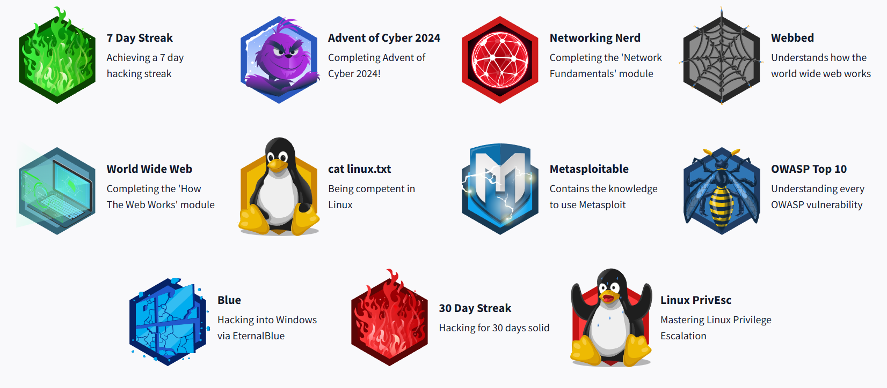

---

### Certificates:

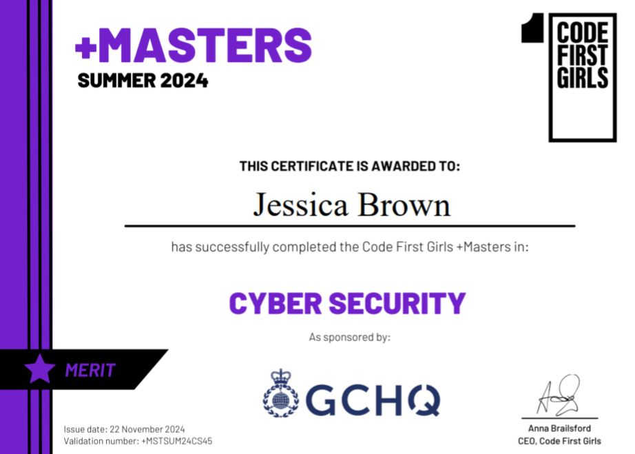
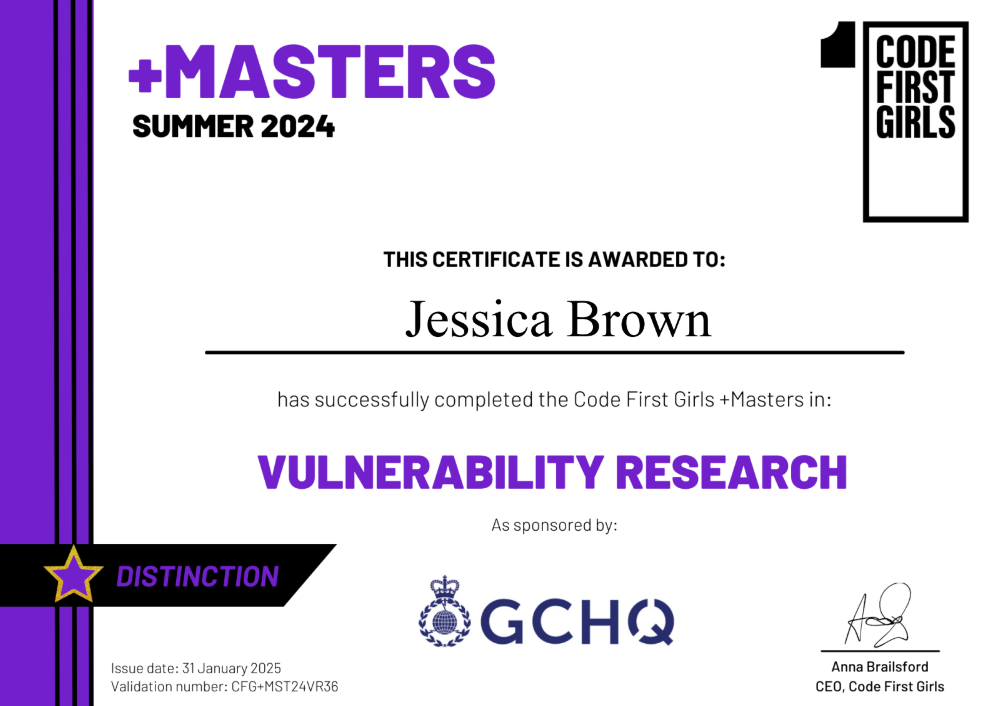

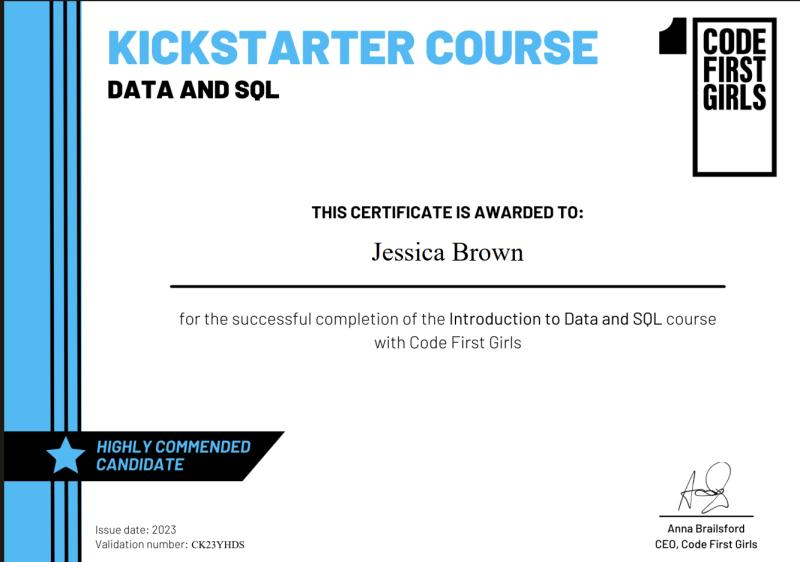
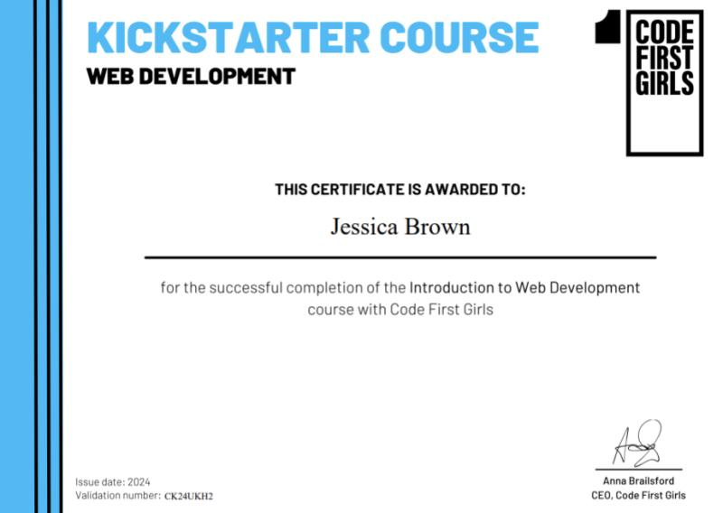
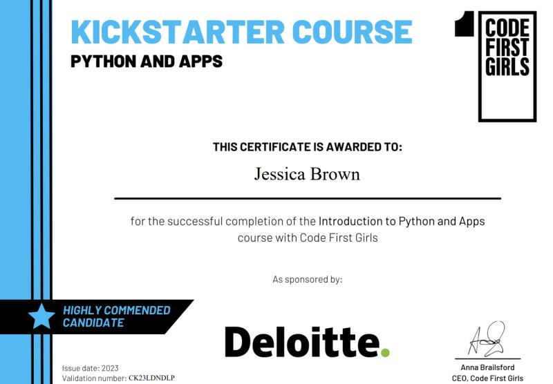
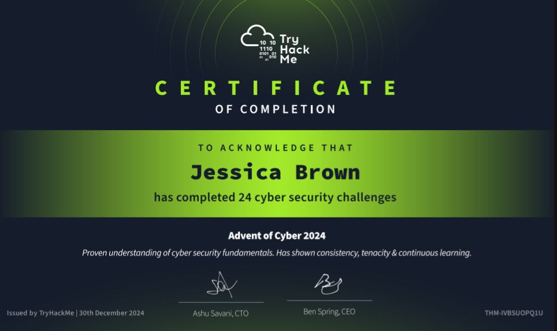

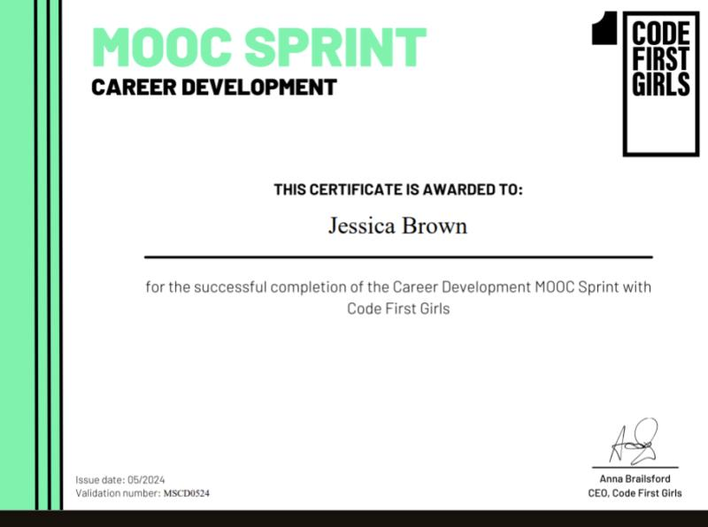
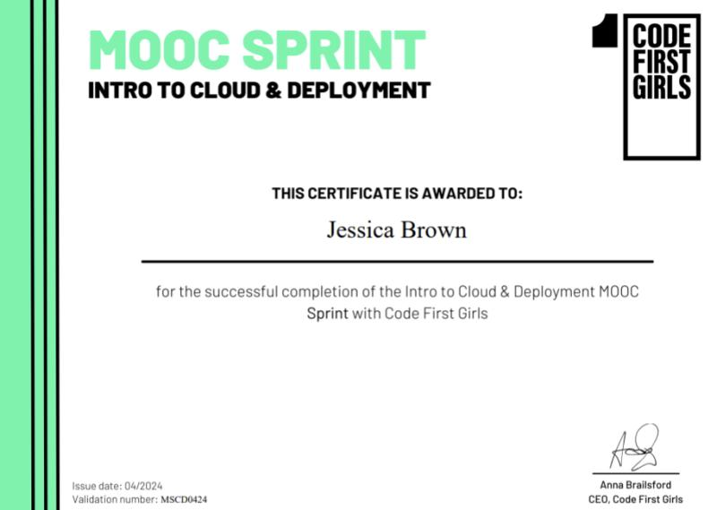
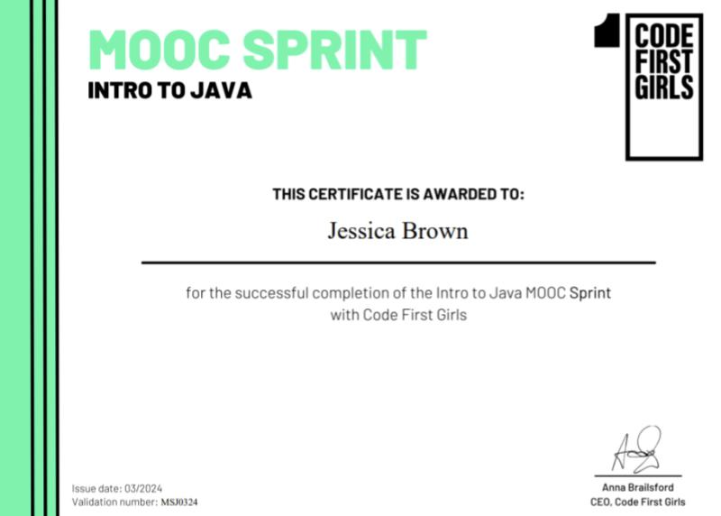
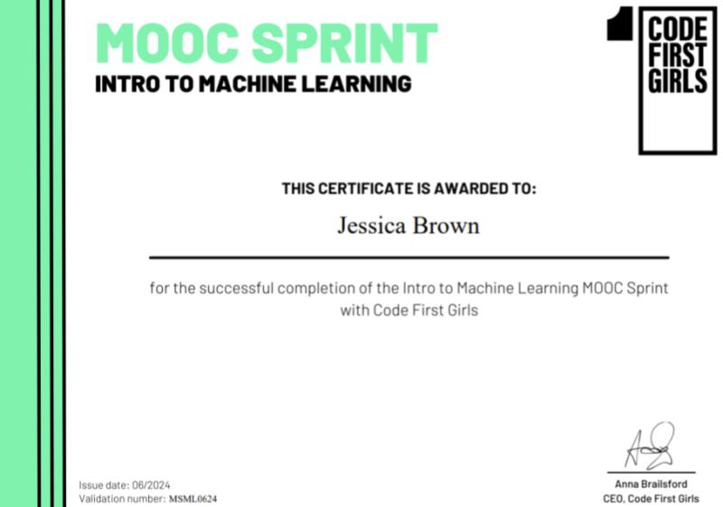

The next certificate I am currently working on is TryHackMe Basic Security to solidify the learning I have already completed and I will then be moving on to the penetration tester learning paths.
                                                 
---

### What's Next:

I am continuing my learning journey on TryHackMe and Hack the Box to develop my skills and practice all the skills I have already gained so far.
I am also wanting to design my own CTF's challenges to gain a more in depth understanding of the mistakes that can be coded which results in vulnerabilities.
Cloud computing is another subject I am keen to pursue and aim to do my AWS certifications in the near future.
 

---

### Created by:
Jessica Brown.

Please feel free to follow me on linkedin I regularly post about my cyber security journey and posts helping others transition into the tech industry.

https://www.linkedin.com/in/jb232020

---

