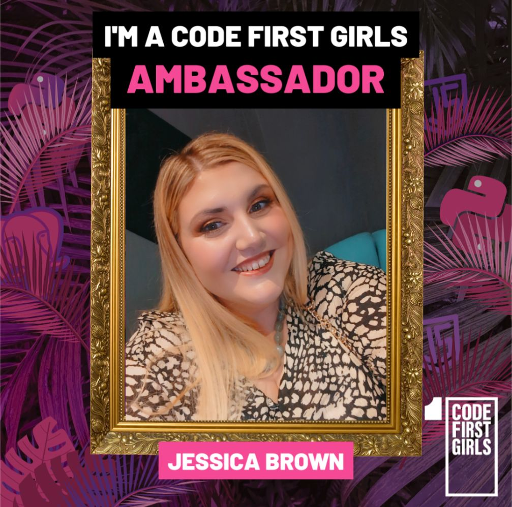

## Jessica Brown Software Engineer specialising in Cyber Security & Vulnerability Research

  <a href="#introduction">Introduction</a> | <a href="#achievements">Achievements</a> | <a href="#certificates">Certificates</a> | <a href="#what_next">What Next</a> | <a href="#Final_Words">Final Words</a> | 

## Introduction
Software engineer with 2 years’ experience at Code First Girls, started with kickstarter courses and ending with the Software and Data Engineering degree followed by the Cyber Security Masters with an additional Vulnerability Research Masters.
Prior to the degree I completed the SQL, Python and Web Development (HTML, CSS, JavaScript) Kickstarters and obtained best in class for each.
I have also completed additional learning in Agile Methodology, AWS, Machine Learning, Java, Cloud and Deployment, AI and Project Management.
I began using TryHackMe during my Cyber Security studies and have continued this throughout January every day to develop my skills and put into practice the skills I gained during my studying, currently I have 11 badges which include OWASP top10, advent of cyber 2024 and Networking nerd. I am also using the hack the box platform to gain more experience working as part of an active team for capture the flag competitions.

---

### Achievements:

⭐Kickstarter SQL

⭐Kickstarter Python

⭐Kickstarter Web Development

⭐Degree Software & Data Engineering

⭐Masters Cyber Security

⭐Masters Vulnerability Research

⭐Moocs (Career, Java, Cloud, Machine Learning)

⭐TryHackMe (Advent of Cyber 2024, Introduction into Cyber Security, Complete Beginner, Pre Security)

⭐Various TryHackMe badges and counting

---

### Certificates:

 
---

 

---

### Final Words:

---

### Created by:
Jessica Brown

🩷Please feel free to follow me on linkedin 🩷

https://www.linkedin.com/in/jb232020

---

## Hi there 👋

<!--
**JessMBrown/JessMBrown** is a ✨ _special_ ✨ repository because its `README.md` (this file) appears on your GitHub profile.

Here are some ideas to get you started:

- 🔭 I’m currently working on ...
- 🌱 I’m currently learning ...
- 👯 I’m looking to collaborate on ...
- 🤔 I’m looking for help with ...
- 💬 Ask me about ...
- 📫 How to reach me: ...
- 😄 Pronouns: ...
- ⚡ Fun fact: ...
-->

